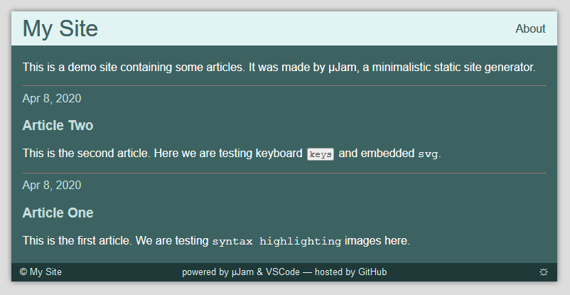

# A simple website template for &mu;Jam

This is a very simple page template for [&mu;Jam &ndash; the minimalistic Jamstack approach](https://github.com/goessner/microjam). No features like *Math Equations* are configured with it.

The page stylesheet is using custom properties (CSS variables). So we can easily switch between *light* and *dark mode*.
Colors are generated by Google's valuable [Tool for picking colors](https://material.io/design/color/the-color-system.html#tools-for-picking-colors). 
With [contrast checker](https://webaim.org/resources/contrastchecker/) we can evaluate accessibility of the chosen colors.

Thank you *Chethan* for recommending these tools in your [great guide](https://blog.prototypr.io/how-to-design-a-dark-theme-for-your-android-app-3daeb264637) for *dark theme design*.

You can see it also [live](https://goessner.github.io/microjam-simple) .
